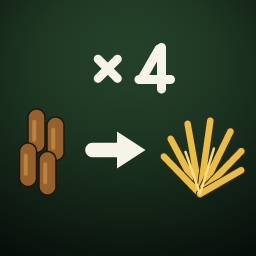

# FS25_MixerWagonPelletFix

**Workaround mod for Farming Simulator 25 + Straw Harvest Pack:** straw/hay
pellets put into a mixer wagon are counted 1:1 by liters, ignoring their ~4:1
compression — about 75 % of the feed value silently disappears. This mod
converts pellets back into the equivalent amount of straw/hay while filling a
mixer wagon.

*Deutsche Beschreibung weiter unten.*

## The problem

The Straw Harvest Pack (Creative Mesh, official free DLC) compresses loose
straw or hay into pellets, e.g. with the Krone Premos 5000: roughly **4,000 l
of loose material become ~1,000 l of pellets** — the mass stays the same,
which is realistic.

Feeding, however, is computed in **liters, not mass**. Tip pellets into a
mixer wagon and the game counts the raw pellet liters 1:1 as straw or hay.
The compression is never converted back, so ~75 % of the feed value is lost.

## The fix

While a mixer wagon is being filled, the mod converts on entry:

| Input           | Becomes            | Factor |
|-----------------|--------------------|--------|
| `STRAW_PELLETS` | `STRAW`            | ~4     |
| `HAY_PELLETS`   | `DRYGRASS_WINDROW` | ~4     |

The factor 4.0 matches the volumetric compression of pelletizing (liters of
loose material in / liters of pellets out), so a pellet detour into the mixer
wagon is exactly neutral — no feed is lost and none is created out of thin
air. The applied factor is printed to `log.txt` on map load and can be
adjusted at the top of the script if a DLC update changes the compression.

> Why not derive the factor from the fill types' mass ratio? The DLC gives
> pellets a realistic density (`massPerLiter` 0.75 vs. straw 0.06 / hay
> 0.07, mass ratio 12.5 / 10.7), but in-game pelletizing itself does not
> conserve mass. Crediting by mass therefore *creates* material: in a test,
> 362 l of hay pellets became ~3,900 l of hay instead of ~1,450 l.
>
> The 4.0 was measured in-game across several runs — hay: 1,209 l → 302 l,
> 571 l → 143 l, 1,120 l → 280 l; straw: 1,029 l → 258 l. Compression is a
> constant 4.00. With the mod, 280 l of pellets yield 1,143 l of hay again.

> An intake throttle (`PELLET_INTAKE_SPEED`) was tried and removed again: material
> the mixer wagon refuses is **not** left in the heap, it is destroyed. Measured
> at 0.5: 143 l of pellets yielded 317 l of hay instead of 572 l. The constant
> is still in the script, but must stay at 1.0.

Scope is deliberately narrow:

- **Only mixer wagons are touched** (any mixer wagon — base game or mod).
- Selling, bedding, storage and transport of pellets stay unchanged.
- Without the Straw Harvest Pack the mod stays inactive.
- All hooks are pcall-guarded: if a game update breaks the conversion, the
  mod disables itself, logs one warning and vanilla behavior remains intact.

## Install

Download `FS25_MixerWagonPelletFix.zip` from the releases page and put it
into your mods folder:

- Windows: `Documents/My Games/FarmingSimulator2025/mods`
- macOS: `~/Library/Application Support/FarmingSimulator2025/mods`

Multiplayer: supported; install on server and clients.

## Tested with

- Farming Simulator 25, version 1.21.1.0 (Steam, macOS)
- Straw Harvest Pack 1.1.0.0

---

## Deutsch

**Workaround-Mod für LS25 + Straw Harvest Pack:** Stroh-/Heupellets werden im
Futtermischwagen 1:1 nach Litern angerechnet, die ~4:1-Kompression wird
ignoriert — rund 75 % des Futterwerts verschwinden. Dieser Mod rechnet
Pellets beim Befüllen eines Mischwagens in die ursprüngliche Menge
Stroh/Heu um.

- Strohpellets → Stroh (Faktor ~4)
- Heupellets → Heu (Faktor ~4)

Der Faktor 4,0 entspricht der Volumenkompression des Pelletierens (Liter
rein / Liter raus) — der Umweg über Pellets ist damit exakt neutral, es
geht kein Futter verloren und es entsteht keines. Nur Mischwagen werden
angefasst — Verkauf, Einstreu und Lagerung bleiben unverändert. Ohne Straw
Harvest Pack bleibt der Mod inaktiv. Multiplayertauglich (auf Server und
Clients installieren).

Installation: `FS25_MixerWagonPelletFix.zip` in den Mods-Ordner legen
(siehe oben).

## License

MIT
